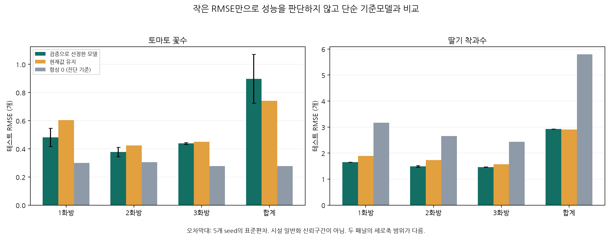
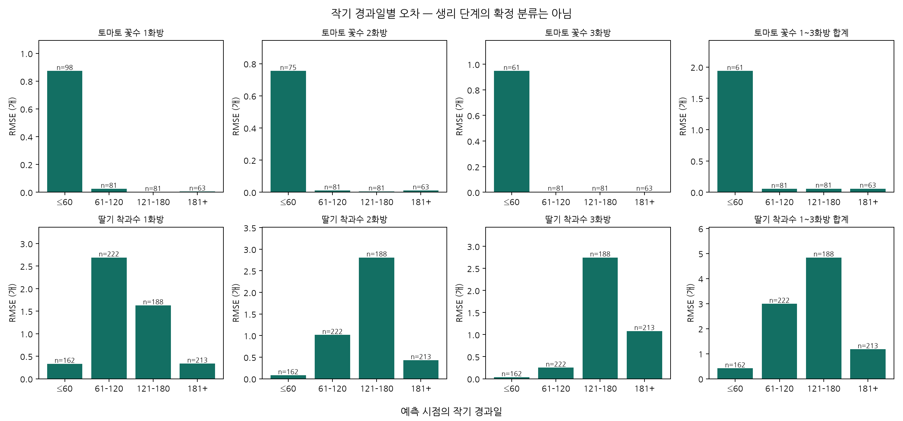
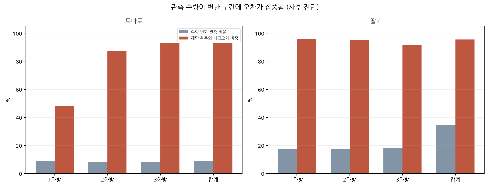

# 1. 생육 예측 기준 성능 및 오차 원인 분석

분석 기준일: 2026-09-14. 완료 시점: 2026-09-12T23:46:03.701380+09:00. 대상: `stability_v2` 8개 예측 타깃.

## 판단 요약

1. **8개 타깃 39,856회가 모두 완료됐다.** 예측 모델의 활용 가능성은 타깃·시설·생육 구간에 따라 다르다. 기존 데이터 전체를 불량 또는 AI에 부적합하다고 결론 낼 근거는 없다.
2. **토마토는 0 중심의 표본 구성과 초기 구간·시설 편차가 핵심 진단 사항이다.** 테스트의 96.3~97.0%가 0이다. RMSE가 작아도 4개 타깃 모두 R²가 음수이고, 항상 0을 예측하는 단순 기준보다 RMSE가 크다. 단, 항상 0을 예측하는 방식도 실제 꽃 발생을 놓치므로 운영 대안으로 채택하자는 뜻은 아니다.
3. **딸기는 관측 이력의 예측 신호가 확인되지만 수량 변화 대응이 부족하다.** 개별 화방은 현재값 유지 대비 테스트 RMSE가 6.9~13.7% 감소했고 R²는 0.58~0.69다. 변화 구간에 제곱오차의 91.6~96.0%가 집중된다.
4. **1~3화방 합계는 별도 개선이 필요하다.** 검증으로 선정한 직접 합계 모델은 유지 기준보다 토마토 RMSE가 21.0%, 딸기가 0.54% 크다. 테스트에서 더 좋아 보이는 다른 모델로 사후 교체하지 않았다.
5. **추가 수집 효과는 아직 검증되지 않았다.** 기존 미활용 변수 확인 → 관측·연결 정합성 점검 → 작업·상태 데이터 추가 → 새 평가 구간의 비교 검증 순서가 적절하다.

## 결과 신뢰성 점검

- 실행 인덱스 39,856개와 실제 result 파일 ID 집합 일치, 상태 전부 success. 24개 prepared 데이터 파일의 해시와 확정 선정 파일의 해시 일치.
- 모델별 최적 변수군 6종 × 5 seeds × 8 targets × 2 splits 및 유지 기준 16개 = **496개 예측 파일**의 row_id·시설·작기·개체·날짜·정답을 원본 평가 표본과 대조했다.
- raw/bounded의 RMSE·MAE·R²·CCC **3,968개 지표를 재계산해 일치**를 확인했다. 총 4,932개 검사 통과. `audit.json`, `tables/integrity_checks.csv` 참조.
- 그 외 후보의 변수군 비교는 해시를 기록한 `Results_Summary.csv`를 사용했다. 39,856개 예측 파일 전부를 재계산한 것은 아니다.
- 공용 `progress.json`에 남은 예전 heartbeat의 running 표시는 종료 판정에 쓰지 않았다. scheduler와 8개 status 및 완료 결과가 기준이다.

## 평가 정의

타깃은 같은 시설·작기·개체의 **다음 실제 조사 시점**의 1·2·3화방 수량 또는 그 합계이다. 고정 7일 후 예측이 아니며, 전체 화방 수량·수확량 예측과도 다르다. 합계에는 1~3화방 관측이 모두 있는 표본만 사용한다. 타깃별 N이 다르므로 서로 다른 타깃의 RMSE를 직접 순위화하지 않는다.

내부 시간 교차검증으로 하이퍼파라미터를 정하고, 시설이 분리된 validation의 bounded RMSE 5개 seed 평균으로 모델·변수군을 선정했다. 동률 순서는 MAE, 변수 수, ID 등 실제 코드의 규칙을 따른다. 이 보고서는 `selection_frozen.json`의 overall을 그대로 사용한다. 각 모델별 최적 결과 전체는 `tables/model_comparison.csv`에 있다.

주 지표는 **각 seed의 지표를 구한 뒤 평균**한 값이며, 표준편차는 학습 초기화 변동이다. 예측 평균으로 앙상블을 만든 뒤 산출한 지표가 아니다. 구간별 SSE 비중은 각 관측의 제곱오차를 seed 평균한 뒤 합산해 계산한다. 유지 기준은 예측 시점의 현재 수량을 그대로 다음 값으로 사용하는 persistence이다. 0 기준은 같은 표본에서 새로 계산한 진단용 상수 모델이다.

**현재 테스트는 이미 확인한 holdout**이므로 이번 분석은 탐색·진단용이다. 시설은 분리됐지만 전체 기간의 전향적 시간 분할은 아니다. 학습 자료에 테스트 시점 이후의 다른 시설 관측도 있으므로 미래 운영 성능을 입증하지 않는다. 관련 판단은 새 시설/작기의 미관측 미래 평가에서 확인해야 한다.

## 8개 타깃 기준 성능

| 타깃                     | 모델          |   검증 RMSE |   테스트 RMSE |   seed SD |   MAE |      R² |   CCC |   유지 기준 RMSE |   유지 대비 개선 % |
|:-------------------------|:--------------|------------:|--------------:|----------:|------:|--------:|------:|-----------------:|-------------------:|
| 토마토 꽃수 1화방        | tabm          |       0.306 |         0.481 |     0.065 | 0.164 |  -1.699 | 0.334 |            0.604 |             20.387 |
| 토마토 꽃수 2화방        | catboost      |       0.247 |         0.378 |     0.033 | 0.124 |  -0.573 | 0.394 |            0.424 |             11.015 |
| 토마토 꽃수 3화방        | random_forest |       0.393 |         0.438 |     0.007 | 0.108 |  -1.572 | 0.362 |            0.450 |              2.796 |
| 토마토 꽃수 1~3화방 합계 | mlp           |       0.446 |         0.897 |     0.174 | 0.250 | -10.116 | 0.246 |            0.741 |            -21.049 |
| 딸기 착과수 1화방        | mlp           |       1.289 |         1.654 |     0.002 | 0.661 |   0.692 | 0.823 |            1.888 |             12.405 |
| 딸기 착과수 2화방        | mlp           |       0.920 |         1.494 |     0.030 | 0.538 |   0.643 | 0.757 |            1.731 |             13.682 |
| 딸기 착과수 3화방        | catboost      |       0.963 |         1.463 |     0.003 | 0.569 |   0.584 | 0.720 |            1.572 |              6.884 |
| 딸기 착과수 1~3화방 합계 | random_forest |       1.748 |         2.925 |     0.003 | 1.387 |   0.664 | 0.782 |            2.910 |             -0.538 |

단위는 RMSE·MAE에서 개수. ‘유지 대비 개선’ 양수는 개선, 음수는 악화다. seed SD는 RMSE의 표준편차. 지표를 타깃 간 합산하지 않는다.

### 네 지표의 해석

- **RMSE:** 큰 오차에 민감하다. 딸기 2화방의 2개 이상 증가 48행은 전체 785행의 6.1%지만 SSE 72.6%를 차지한다. 큰 증가를 놓치는 문제가 RMSE에 드러난다.
- **MAE:** 일반적인 오차 크기를 나타내지만 0·무변화가 많은 전체 평균만 보면 변화 구간의 문제를 감춘다. 딸기 2화방 전체 MAE 0.538개와 변화 구간 MAE 2.439개를 함께 봐야 한다.
- **R²:** 평가 정답의 분산 대비 오차다. 토마토 테스트의 정답 변동이 매우 작아 R²가 -1.70, -0.57, -1.57, -10.12로 나타났다. 산출 오류가 아니라 재계산으로 확인된 값이다. 음수 R²는 테스트 정답 평균을 쓰는 수학적 참조보다 SSE가 크다는 뜻이며, 입력과 정답의 관계가 전혀 없다는 뜻은 아니다. 상수 정답 구간의 R²는 미정의로 남겼다.
- **CCC:** 수량의 변동과 수준 일치를 함께 반영한다. 토마토 0.246~0.394, 딸기 0.720~0.823이다. 딸기에서는 전체 CCC가 높아도 급증 구간의 과소예측이 남아 있으므로 구간 bias와 함께 판단해야 한다.

## 표본 규모와 구성

| 타깃                     |   N |   0 비율 % |   변화 N |   변화 RMSE |   변화 구간 SSE % |   양수 N |
|:-------------------------|----:|-----------:|---------:|------------:|------------------:|---------:|
| 토마토 꽃수 1화방        | 323 |     96.285 |       29 |       1.121 |            48.162 |       12 |
| 토마토 꽃수 2화방        | 300 |     97.000 |       25 |       1.220 |            87.273 |        9 |
| 토마토 꽃수 3화방        | 286 |     96.503 |       24 |       1.458 |            93.066 |       10 |
| 토마토 꽃수 1~3화방 합계 | 286 |     96.503 |       26 |       2.868 |            92.857 |       10 |
| 딸기 착과수 1화방        | 785 |     83.694 |      135 |       3.908 |            96.020 |      128 |
| 딸기 착과수 2화방        | 785 |     81.783 |      136 |       3.508 |            95.447 |      143 |
| 딸기 착과수 3화방        | 785 |     80.382 |      143 |       3.282 |            91.627 |      154 |
| 딸기 착과수 1~3화방 합계 | 785 |     63.057 |      271 |       4.868 |            95.602 |      290 |

토마토 train은 타깃별 1,497~1,553행, 6시설·8~12작기이며 validation은 2시설, test는 2시설·3작기다. 딸기는 타깃별 train 3,653행·14시설·20작기, validation 780행·3시설·4작기, test 785행·3시설·4작기다. 같은 개체를 반복 조사한 행과 8개 타깃을 독립 표본처럼 합산하면 안 된다.

토마토 테스트 양수 표본은 타깃별 9~12행에 불과하다. ‘총 행 수가 충분한가’보다 **새 시설 수·독립 작기 수·양수 및 변화 사건의 수**가 중요한 제한이다. 표본 추가가 성능을 얼마나 높이는지는 현재 결과만으로 확정할 수 없으며, 시설/작기 수를 늘리는 학습곡선을 별도로 검증해야 한다.

## 시설·작기·조사 간격·생육 변화별 진단

### 시설 및 작기

토마토 PF_0026456_01/작기 208은 34~53행으로 테스트의 11.9~16.4%지만 타깃별 SSE의 72.1~91.0%를 차지한다. 다른 시설에서 양호한 평균이 이 시설의 높은 과대예측을 가리고 있다. 토마토 합계 RMSE는 이 시설에서 2.474개, PF_0024697_01에서 0.290개다.

딸기 PF_0024700_01/작기 PF_0024700|7546|2024-09-10의 234행은 2화방 SSE 66.0%, 3화방 68.3%, 합계 64.7%를 차지한다. 합계 RMSE는 4.309개이며 유지 기준 3.927개보다 크다. 이 시설을 제외하면 전체 합계 모델 RMSE가 2.075개가 되지만, **제외해 성능을 개선했다고 보고하지 않는다.** 시설 민감도 확인용이다.

동일 시설의 작기 간 차이도 크다. 토마토 PF_0024697_01의 1화방은 작기 177에서 RMSE 0.159개(N=243), 작기 178에서 0.743개(N=27)다. 딸기 PF_0023732_01의 1화방은 2024 작기 1.569개(N=274), 2025 작기 0.150개(N=81)다. 작은 작기 표본과 수량 분포 차이를 함께 보아야 하며, 특정 시설 특성이나 재배 방식이 원인이라고 단정할 수 없다.

근거: `tables/error_strata.csv`의 facility/crop_cycle 및 `leave_one_facility_sensitivity.csv`.

### 조사 간격

‘직전 조사 후 경과일’은 예측 시점에 아는 입력이고, ‘다음 실제 조사까지 간격’은 사후에 확인되는 예측 거리다. 둘을 분리했다. 모든 작물의 중앙값은 7일이지만 test의 다음 조사 간격은 토마토 최대 10일, 딸기 최대 28일이다.

토마토 3화방은 다음 조사 간격 1~7일 RMSE 0.098개(N=207), 8~14일 0.818개(N=79)다. 다만 이 차이는 시설·작기 초기 및 수량 변화 분포와 겹친다. `crossed_error_strata.csv`에서 시설×경과일×간격을 함께 확인할 수 있다. **간격만 길어서 오차가 증가한다고 인과 해석하지 않는다.** 같은 PF_0026456_01 시설·≤60일로 좁혀도 토마토 합계 RMSE는 1~7일 0.908개(N=27), 8일 이상 5.153개(N=7)로 다르지만, 후자의 표본 7행으로 인과나 일반화를 확정할 수 없다. 딸기 15~28일 구간 10행은 0 중심이라 오히려 오차가 작다. 긴 간격을 일률적으로 고위험 처리할 근거는 없다.

### 작기 경과일 및 수량 변화

토마토는 4개 타깃 모두 작기 시작 후 60일 이내에 SSE의 **99.6~100.0%**가 집중된다. 고정된 1~3화방의 꽃수가 이후 0으로 관측되는 기간이 길다는 구성과 부합한다. ‘60일’을 생리학적으로 확정된 개화 경계로 해석하지 않고, 초기 집중 관측·화방 상태 확인을 위한 후보 구간으로 쓴다.

딸기 1화방은 61~120일에 SSE 74.8%, 2·3화방은 121~180일에 각각 84.6%, 84.4%, 합계는 같은 구간에 65.6%가 집중된다. 이 역시 작기 경과일에 따른 사후 분류이며 실제 생리 단계 라벨이 아니다.

딸기에서 2개 이상 증가한 구간의 평균 bias(예측−실제)는 1·2·3화방·합계 순서로 **-4.49, -4.02, -3.56, -4.77개**다. 반대로 2개 이상 감소 구간에서는 **+2.55, +2.12, +1.45, +2.46개**다. 이는 변화폭을 충분히 따라가지 못하는 양상이다. 수정·적과·수확·낙과 등을 실제 원인으로 확인하려면 시점과 수량이 연결된 작업/상태 기록이 필요하다.

토마토 1화방은 변화 관측뿐 아니라 무변화 관측도 SSE 51.8%를 차지한다. 토마토 전체를 ‘급변만 해결하면 된다’고 일반화하지 않는다. 과대예측이 발생한 초기/시설 구간도 함께 확인해야 한다.

수량 변화 및 양수 여부는 미래 정답으로 나눈 **사후 진단 구간**이다. 운영 화면의 사전 경보나 입력 피처에 그대로 사용할 수 없다. N<30은 소표본 표시, 빈 구간은 0점 대신 미평가로 표시한다.

## 기존 입력 활용 범위와 추가 정보 필요성의 구분

### 확인된 기존 입력 신호

동일 모델·동일 검증 표본에서 범주 하나를 추가한 조합 쌍을 비교했다. 각 조합은 별도 튜닝됐으므로 엄밀한 고정 파라미터 ablation이나 인과 효과가 아니다.

딸기 착과수 관측 이력을 추가한 쌍의 RMSE 차이 중앙값은 1·2·3화방·합계에서 -0.693, -0.586, -0.412, -1.001개다. 해당 비교에서 관측 이력은 유용한 신호다. 토마토의 온습도·CO2 추가 효과는 타깃·조합·모델에 따라 개선과 악화가 함께 나타났다. 예컨대 온습도 추가의 중앙 RMSE 차이는 1화방 +0.009, 2화방 -0.033, 3화방 -0.056, 합계 -0.025개다. ‘환경 정보는 항상 유효/무효’라는 결론은 성립하지 않는다.

### 기존에 있지만 이번 실험에서 미활용한 항목

딸기 prepared 데이터에 `leaves_length`, `leaves_num`, `theca_diameter`가 모두 존재하고, 분석 표본에서 숫자 결측은 없지만 10개 등록 조합에는 포함되지 않았다. **기존 데이터 활용 확대의 우선 후보**다. 관측 단위·스케일·조사 시점의 의미는 원천 정의와 확인해야 하며, 값이 존재한다는 사실만으로 품질 검증을 완료했다고 보지 않는다. 새 AX 수집 효과와 혼동하지 않도록 별도 실험군으로 평가한다.

### 수치 보정·결측의 영향

선정 모델의 입력별 결측률과 학습 범위 이탈률을 `selected_input_diagnostics.csv`에 제공했다. 초기 이력 부족과 아직 양수가 나오지 않아 정의되지 않은 경과일 등이 섞일 수 있으므로 모두 수집 실패로 해석하지 않는다. 토마토 test의 선택 입력은 학습 변수별 최소·최대 범위를 벗어나지 않았지만 시설별 오차는 컸다. 단변량 범위 내라는 사실이 결합 분포의 동일성을 보장하지 않는다.

raw→bounded 보정은 일부 모델에서 자주 발생하지만, 선정 모델의 테스트 RMSE 변화는 최대 약 0.00103개(토마토 합계)다. 현재 성능 차이를 출력 클리핑만으로 설명할 수 없다. 딸기 2화방은 3/785행, 3화방은 1/785행의 정답이 train 상한을 초과한다. 극단 수량 표본 확대와 상한 정책은 향후 별도 민감도 과제로 검토한다.

### 원인 분류 결론

| 구분 | 이번 결과로 확인한 사실 | 아직 확인되지 않은 것 | 다음 검증 |
|---|---|---|---|
| 기존 데이터 활용 한계 | 등록 변수군 범위 제한, 딸기 생육 3항목 미활용, 온습도 추가 효과 혼재 | 기존 데이터 전체가 AI에 부적합하다는 주장 | 동일 표본에서 기존 미활용 변수만 추가 |
| 표본 규모·대표성 | test 시설 2/3개, 토마토 양수 9~12행, 특정 시설·작기에 SSE 집중 | 표본 확대만으로 성능이 얼마나 좋아지는지 | train 시설/작기 단위 학습곡선 및 새 시설 외부평가 |
| 추가 정보 필요성 | 증가·감소를 충분히 추종하지 못함, 작업/화방 상태가 입력에서 직접 식별되지 않음 | 적과·수확·수정 이력이 실제로 얼마의 오차를 줄이는지 | 시간 정합된 이벤트 수집 및 동일 조건의 AX ablation |
| 모델·목표 정의 | 합계 모델은 유지 기준보다 악화, 초기 구간이 전체와 상이 | 더 복잡한 모델 또는 신규 데이터만이 해결책인지 | 동일 데이터의 단순 기준·합계 방식·변화 예측 비교 |

## 타깃별 후속 검증 초점

| 타깃                     | 관측 근거                                                                          | 검증 방향                                                                                                                    |
|:-------------------------|:-----------------------------------------------------------------------------------|:-----------------------------------------------------------------------------------------------------------------------------|
| 토마토 꽃수 1화방        | 작기 ≤60일에 SSE 99.9%; PF_0026456_01 시설 53행에서 SSE 72.1%; 0 예측보다 RMSE 큼  | 화방 생리 상태·0 의미 및 초기 관측 정합성 확인; 초기 이력 확보; 시설별 추가 평가                                             |
| 토마토 꽃수 2화방        | 작기 ≤60일에 SSE 100.0%; PF_0026456_01 시설 44행에서 SSE 77.2%; 0 예측보다 RMSE 큼 | 화방 생리 상태·0 의미 및 초기 관측 정합성 확인; 초기 이력 확보; 시설별 추가 평가                                             |
| 토마토 꽃수 3화방        | 작기 ≤60일에 SSE 100.0%; PF_0026456_01 시설 34행에서 SSE 88.7%; 0 예측보다 RMSE 큼 | 화방 생리 상태·0 의미 및 초기 관측 정합성 확인; 초기 이력 확보; 시설별 추가 평가                                             |
| 토마토 꽃수 1~3화방 합계 | 작기 ≤60일에 SSE 99.6%; PF_0026456_01 시설 34행에서 SSE 91.0%; 0 예측보다 RMSE 큼  | 화방 생리 상태·0 의미 및 초기 관측 정합성 확인; 초기 이력 확보; 시설별 추가 평가; 합계 산출 방식 및 단순 유지 기준 우선 비교 |
| 딸기 착과수 1화방        | 2개 이상 증가 46행의 bias -4.49개, SSE 60.2%; 변화 구간 오차 집중                  | 기존 생육 변수 활용 검증 → 수정·적과·수확 등 작업 및 화방 상태 연계                                                          |
| 딸기 착과수 2화방        | 2개 이상 증가 48행의 bias -4.02개, SSE 72.6%; 변화 구간 오차 집중                  | 기존 생육 변수 활용 검증 → 수정·적과·수확 등 작업 및 화방 상태 연계                                                          |
| 딸기 착과수 3화방        | 2개 이상 증가 45행의 bias -3.56개, SSE 54.9%; 변화 구간 오차 집중                  | 기존 생육 변수 활용 검증 → 수정·적과·수확 등 작업 및 화방 상태 연계                                                          |
| 딸기 착과수 1~3화방 합계 | 2개 이상 증가 91행의 bias -4.77개, SSE 49.5%; 변화 구간 오차 집중                  | 기존 생육 변수 활용 검증 → 수정·적과·수확 등 작업 및 화방 상태 연계; 합계 산출 방식 및 단순 유지 기준 우선 비교              |

## 근거 자료와 해석 범위

- [S1] [0826 회의록](../../../회의록_AX데이터구축_0826.pdf), 6~7항: 꽃수·착과수 모델의 검증 역할, 수확량과의 구분, 지표 정확성 확인. 이 보고서의 상대 링크 대신 `sources/회의록_AX데이터구축_0826.txt`에서 본문 확인 가능.
- [S2] [0909 회의록](../../../회의록_AX데이터구축_0909.pdf), 2~4항 및 향후 조치: 원인 구분, 지표별 설명, 개선 과업과 As-Is/To-Be 대응 요구. **파일명은 0909이지만 본문 회의일은 2026-09-10**이다. `sources/회의록_AX데이터구축_0909.txt` 제공.
- [S3] `../../outputs/stability_v2/`: 확정된 실험 데이터·선정 결과·예측 파일. 상대 경로는 이 문서 폴더 기준이다.
- [S4] `../../stability/engine.py`, `policy.py`, `data.py`: 선정 규칙, train 기반 보정, 다음 관측 타깃과 시설 분할 정의. 읽은 파일의 SHA-256은 `source_hashes.json`에 기록했다.
- 회의록은 과업 요구의 근거이며, 회의 당시의 수치·해석을 이번 8개 타깃 실험의 사실로 전용하지 않았다. 외부 문헌 검토나 신규 모델 학습은 이번 산출물 범위에 포함하지 않았다.
